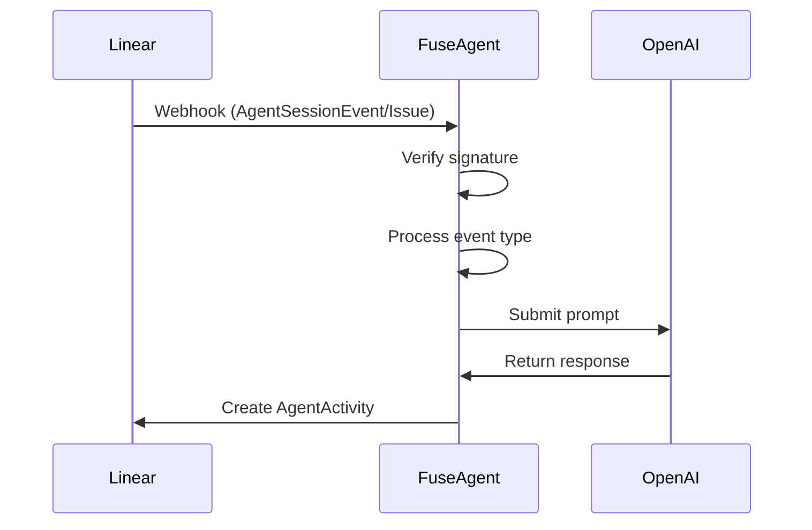

# Fuse Agent for Linear Integration

A Agent that processes Linear tasks through OpenAI-powered operations. The system handles OAuth authentication with Linear, webhook processing, and maintains *conversation state*.

## Architecture

```
.
├── docker-compose.local.yml      
├── src/
│   ├── index.ts                  
│   ├── lib/
│   │   ├── agent/
│   │   │   ├── agentClient.ts    # Core agent logic
│   │   │   ├── prompt.ts         # Agent instruction prompt
│   │   │   └── tools.ts          # Available operations
│   │   ├── oauth.ts              # Linear OAuth handling
│   │   ├── storage/
│   │   ├── types.ts              
│   │   └── webhookTypes.ts       
│   └── utils.ts                  
└── .env.example                  # Environment configuration template
```

## Core Components

### 1. Agent Client (`src/lib/agent/agentClient.ts`)
- Manages task processing workflow
- Maintains conversation state
- Interfaces with OpenAI API

### 2. Storage Implementations
- **SQLiteStateStorage**: Persistent conversation state
- **InMemoryActivityStorage**: Temporary activity tracking

### 3. OAuth Handler (`src/lib/oauth.ts`)
- Manages Linear OAuth flow
- Token storage and retrieval
- Webhook verification

### 4. Webhook Processor (`src/index.ts`)
- Endpoint: `POST /webhook`
- Handles Linear webhook events
- Routes to appropriate handlers

## Setup

### Prerequisites
- Linear workspace
- OpenAI API key

### Configuration
1. Copy `.env.example` to `.env` and update values:
```bash
cp .env.example .env
```

2. Update environment variables:
```env
LINEAR_CLIENT_ID=your_linear_client_id
LINEAR_CLIENT_SECRET=your_linear_client_secret
OPENAI_API_KEY=your_openai_api_key
LINEAR_WEBHOOK_SECRET=your_webhook_secret
WORKER_URL=http://localhost:3000
```

## Development

### Local Execution

use some tool like ngrok to expose the service and remember updates urls in `.env` and linear  (project-settings->api)

```bash
    npm run dev
```


## Webhook Processing Flow
1. Linear sends webhook to `/webhook`
2. System verifies signature using `LINEAR_WEBHOOK_SECRET`
3. Handles two event types:
   - `AgentSessionEvent`
   - `Issue`



## Agent Prompt Structure
The agent follows strict response formatting rules defined in [`src/lib/agent/prompt.ts`](src/lib/agent/prompt.ts):

```ts
export const prompt = `You're a helpful engineering assistant...
CRITICAL: You can only emit ONE of these per response:
- THINKING: For observations and analysis
- ACTION: To call available tools
- ELICITATION: To request missing context
- RESPONSE: Final output
- ERROR: Error reporting

Available tools:
- listenToLinear(project, labels)
- getTaskDetails(taskId)
- forkRepository(repoUrl)
- readFileFromRepo(repoUrl, filePath)
- updateFileInRepo(repoUrl, filePath, newContent, branchName)
- createPullRequest(repoUrl, fromBranch, toBranch, title, body)
- addCommentToLinear(taskId, comment)
- changeLinearTaskStatus(taskId, status)
`;
```

## License
MIT License
