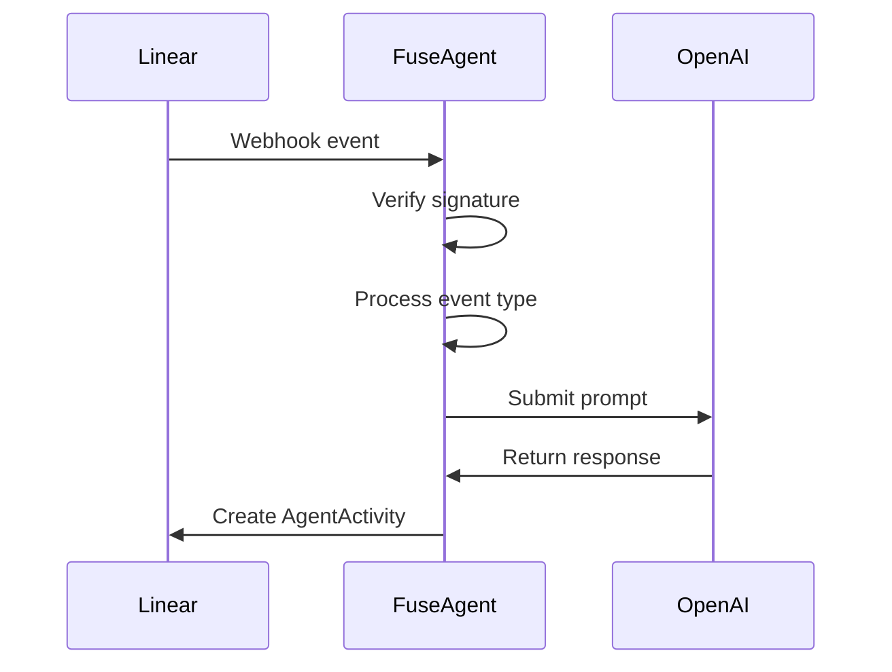

# Fuse Agent for Linear Integration

A sophisticated agent that processes Linear tasks through OpenAI-powered operations. The system handles OAuth authentication with Linear, webhook processing, and maintains conversation state. *Based on [weather-bot from linear](https://github.com/linear/weather-bot)* reworked without Cloudflare integration

## Architecture

```
.
├── src/
│   ├── index.ts                  
│   ├── lib/
│   │   ├── agent/
│   │   │   ├── agentClient.ts    # Core agent logic
│   │   │   ├── prompt.ts         # Agent instruction prompt
│   │   │   └── tools.ts          # Available operations
│   │   ├── oauth.ts              # Linear OAuth handling
│   │   ├── storage/              # State management implementations
│   │   ├── types.ts              # Type definitions
│   │   └── webhookTypes.ts       # Webhook payload handling
│   └── utils.ts                  # Utility functions
└── .env.example                  # Environment configuration template
```

## Core Components

### 1. Agent Client ([`src/lib/agent/agentClient.ts`](src/lib/agent/agentClient.ts))
- Manages task processing workflow
- Maintains conversation state
- Interfaces with OpenAI API

### 2. OAuth Handler ([`src/lib/oauth.ts`](src/lib/oauth.ts))
- Manages Linear OAuth flow
- Token storage and retrieval
- Webhook verification

### 3. Storage Implementations ([`src/lib/storage/`](src/lib/storage/))
- SQLiteStateStorage: Persistent conversation state
- InMemoryActivityStorage: Temporary activity tracking

## Setup

### Prerequisites
- Linear workspace
- OpenAI API key

### Configuration
1. Copy `.env.example` to `.env`:
```bash
cp .env.example .env
```

2. Update environment variables:
```env
LINEAR_CLIENT_ID=your_linear_client_id
LINEAR_CLIENT_SECRET=your_linear_client_secret
OPENAI_API_KEY=your_openai_api_key
LINEAR_WEBHOOK_SECRET=your_webhook_secret
WORKER_URL=http://localhost:3000
```

## Development

### Local Execution
1. Start the development server:
```bash
npm run dev
```

2. Expose your local service using ngrok:
```bash
ngrok http 3000
```

3. Update configuration:
- Set `WORKER_URL` in `.env` to your ngrok URL
- Update Linear project settings (Project → Settings → API) with the ngrok URL

## Webhook Processing Flow
1. Linear sends webhook to `/webhook`
2. System verifies signature using `LINEAR_WEBHOOK_SECRET`
3. Handles event types:
   - `AgentSessionEvent`: Processes user prompts
   - `Issue`: Filters and processes task-related events



## Agent Prompt Structure
The agent follows strict response formatting rules defined in [`src/lib/agent/prompt.ts`](src/lib/agent/prompt.ts):

```ts
export const prompt = `You're a helpful engineering assistant...
CRITICAL: You can only emit ONE of these per response:
- THINKING: For observations and analysis
- ACTION: To call available tools
- ELICITATION: To request missing context
- RESPONSE: Final output
- ERROR: Error reporting

Available tools:
- listenToLinear(project, labels)
- getTaskDetails(taskId)
- forkRepository(repoUrl)
- readFileFromRepo(repoUrl, filePath)
- updateFileInRepo(repoUrl, filePath, newContent, branchName)
- createPullRequest(repoUrl, fromBranch, toBranch, title, body)
- addCommentToLinear(taskId, comment)
- changeLinearTaskStatus(taskId, status)
`;
```

## License
MIT License
